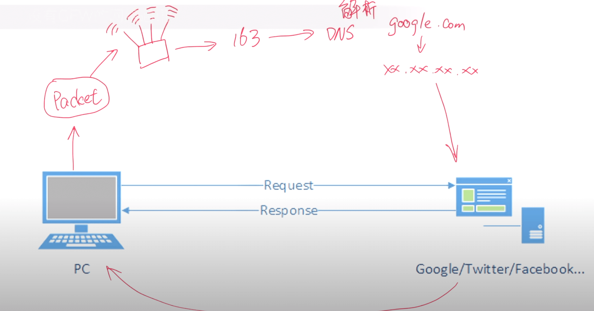
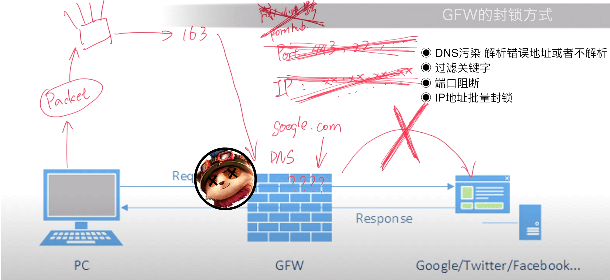

>**GFW的相关介绍**
​
## 什么是墙？
​
墙是防火长城，GFW英文的全称是Great Fire Wall
​
​
## 设立墙的目的  

- 分析和过滤境外资讯和互相访问

  
- 过滤国外反动信息，维护国家统一和稳定 

## 设立GFW的导火索  
​
08年前奥运会前夕，恐怖组织在Facebook上策划协调，并且实施了对我国西部地区的一个恐怖袭击。中国政府当时就要求Facebook配合审查，以防再次出现此类事件。但是Facebook以尊重保护用户隐私这样的一个理由来拒绝了。同时，Google也以同样的理由拒绝了中国政府的要求，所以大陆政府就不让这些不愿意配合的外国公司在中国展开业务。    

于是Facebook还有Google的一系列服务，包括搜索引擎，YouTube，Gmail等等都被封了。同期被陆续封锁还有Twitter，Tumblr这些比较大的互联网提供商，经过一段时间的审查制度的和GFW的越来越规范化，导致甚至一些本不涉及到政治和国民安全的互联网服务，比如说成人网站也都被封了（哭唧唧，这不是要了命了～）
​
## GFW的工作原理  

在没有GFW的完美情况下，一个网络通讯的数据包是这样运作的。  

  

首先从本地计算机发出一个数据包请求，经过本地网络接入骨干网，经由DNS（Domain Name Servers）域名解析。就是把输入的这一串英文字符到底是要连接到哪个服务器的真实ip地址解析出来。比如输入google.com，DNS就会把这个地址解析成真实的服务器地址。  
这一串经过解析之后到达国际出口，最后接入到对应的服务器，服务器对数据进行处理，然后返回一个数据包，再发送回计算机。  

有了GFW之后，就变成了下面这样。  

  

- DNS污染（劫持）
  同样本地计算机发出了一个数据包给Google，经过本地网络接入骨干网，经由DNS解析。因为数据包发送的方式是HTTP，是一种明文的流量，GFW可以探测到流量的部分内容。一看到你访问的是Google，于是给你解析出一个错误的服务器地址，于是你就访问不了Google了。

  
- 关键词阻断
  GFW探测到HTTP流量的内容，这一点是另一个GFW用来封锁网络的方式，叫做关键字阻断。当传输的这个数据流里面包含一些敏感词的时候就会被中断连接。

  
- 数据归集屏蔽
  除此之外GFW还会在某些特定的IP服务器的主机的特定端口，进行端口阻断来切断VPN或者是SSL的连接，比如443,242这些端口。经过一些时间的运作GFW还会把记录到的大量IP地址进行屏蔽，导致很多国外网站被封锁。

  
以上这些就是大概的GFW的工作方式，但是不限于这些。随着时间的推进还会有很多新的方式来阻断连接。同时我们也会采用新的方式来突破这个封锁。这种博弈，就是目前的这个现状。
​
